### 简介

这是一个户外的运动 app ，在开始它会记录你的一些身体信息。当你使用它在户外跑步的时候，它会记录你运动的轨迹，运动时间、运动里程、速度等等。当然还包括你运动时产生的想法，一张代表你心情、想法或是记录美丽风景的照片。整 app 围绕这数据的产生（记录），数据的存储，数据的展示进行。
   
当然上面的语言太官方了，不过这可以让绝大多数人迅速了解这款应用的功能。接下来可能是一些不着边际的话。因为绝大多数功能在这个第一版的 app 里并未实现，不过这代表这产品的进化方向。主要阐述我对这个产品一些设计上的理念或是情怀，对产品用户需求的分析以及对运动类移动应用功能发展的探讨，最后是一些对技术层面实现的相关说明。

### 设计理念
- ####记录
生活的点滴需要记录。正真意义上的历史长生源于文字，因为从那时候起，生活的剪影和头脑中的灵光移动得以凝聚在抽象的文字中，传承和分享从此展开。而今天我们居然可以如你廉价和方便的记录我们在时空中的轨迹，它刻录着你人生的印记。某个陌生的城市，某个风和日丽的早晨，某个人的背影，还有你时光的印记。
   
    **状态：**所处的时间、空间、天气
    **瞬间：**光影凝固瞬间，文字记录感动
    **痕迹：**无论是日常的晨跑，还是陌生城市的夜跑，记录生活和旅途的轨迹
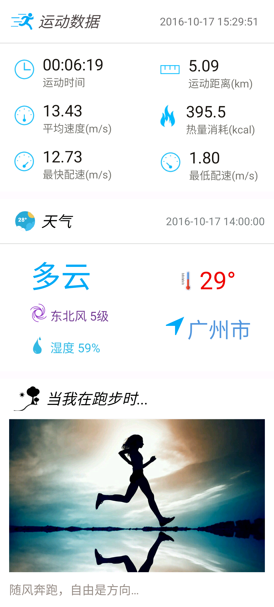

    记住，你不是在记录生活。
    生活的轨迹取决于你奔跑的速度和方向。
    生活由你创造，而我有幸见证！

- #### 分享
生活的喜悦需要分享，无论是奔跑的姿态，沿途的风景，还是那些振奋人心的数字  

    **展示:** 展示你积极向上的健康生活态度和丰硕的运动果实
    **分享:**分享奔跑时的激情与喜悦，无论是熟人还是陌生人。我们各自奔跑在各自的轨道，那些交集和分叉令人感动
    **挑战：**每一次对自我的挑战，每一次对他人的超越，都需要分享，你的快乐
需要全世界知道
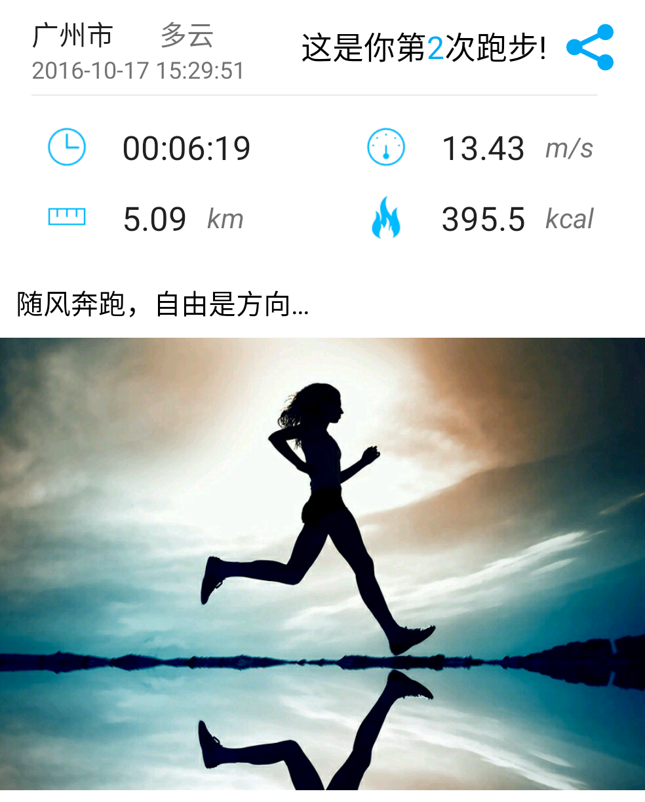
    也许，我们分享得太多，
    以至于忘记了为什么而出发。
    那又如何？
    奔跑自由是方向，
    我们总能在前进中找到最好的自己。
 
### 需求分析 
作为第一版的产品，很多功能还都不完善，有的只是数据的记录和简单的展示，那么接下来整个产品将围绕这如何让用户产生更多的数据，如果更好的展示数据和对数据的挖掘上。相信下面这幅图所显示的改进半的马斯洛需求模型很能反应当代人的需求层级。
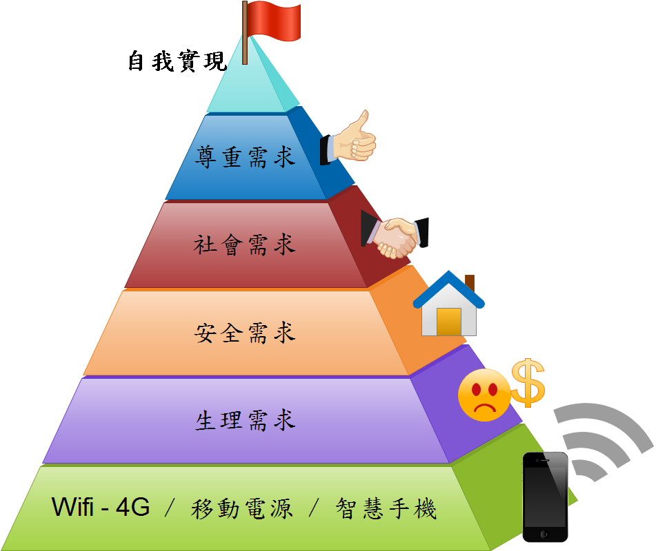

- #### 时代背景 
当我们分析事物和人的时候，肯定要了解当时的时代背景。当我们分析一篇文章某处人物的动机的时候，总要联系上下文才能分析出来。正如 Android 开发中所遇到的一样，一切活动（Activity）的展开都离不开上下文（Context）。

  跑步作为一项古老的运动，伴随这整个人类文明的发展。在远古的时候，人类必须奔跑，并且奔跑的很快。因为更快的奔跑可以让人逃命和捕猎中获得先机，所以在那时，跑步是一项生存技能。要想活下去，你必须奔跑的更快。随着武器和工具的发明，跑步在人类生存中占据的分量逐渐弱化。当然，正真让跑步重要地位丧失的还是，人类大规模的进入农耕社会，人们不再随意迁徙，和到处捕猎。人们开始有了聚集地，在一个固定的地方农耕、驯化动物和饲养家禽。除了少数人群之外，人们已经没有了快速和长距离奔跑的需求。当然压死骆驼的最后一根草还是来了，随着工业文明的到来，需要奔跑的场景被压缩到极小的角落里，当然机器淘汰的不只是跑步。特别是21世纪，人类的身体似乎只要一颗大脑就足够了。

  当然，跑步被人类抛弃的情况并没有发生。因为跑步成功完成了转型。这样的例子有很多。骑马的功能虽然被车取代了，带它变成了人们休闲、娱乐的方式，甚至成了一项体育运动。在机械表市场，如果只拼走时的精准，和制表的工艺，瑞士表差不多已经被日本的机械表超越了。不过瑞士表成功完成了转型，将工具变成了首饰，买的不是表，卖的是历史传承、匠人精神甚至是符号象征。

  从以上例子可以看出，伴随人类发展密切的众多活动并不会随着人类的发展淡出历史的舞台。相反，它会在新的舞台重新换发生机。当然凡事都是有条件的，这些活动往往和人类的本性有关，随着时代的发展也难以消除，还有就是人类文明的抽象象征。总的来说接近人本身属性和那些与具体功能无关的东西往往能够得以传承和发展。比如人的身体属性，还有那些脱离了具体的文化艺术，他们往往会在新时代被赋予新的意义。

  跑步就是这样的。随着人类文明的发展，跑步从人的生存技能脱离之后，它变成了一项活动、运动。此时人们有了更多的时间和精力去追求精神享受。人们在跑步的活动中获得乐趣，在观看体育竞技中寻求享受。但我回到我们这时代，跑步的运动特点决定了，它不是一项好玩的活动，甚至它是枯燥的。我们只能在你争我敢的激烈竞技中，在令人瞠目的记录面前，让我们重温丛林法则时代给予我们的刺激与震撼。

 但另一方面我们看到，正是由于跑步的运动属性，它可以很自由的进行，不需要任何额外的场地，不受空间的性质，可以走过不同的地方，这使得跑步很容易大众化。跑步面临的第二个问题是，人们没有事件去锻炼，这更像是中产阶级的专属产品。

  显然，时代在发展。随着人们生活水平的提高，人们有更多的时间去享受，更加注重对身体健康的追求，跑步也日益民主化。当然，跑步这么流行更重要的原因在于成为了一种精神消费或是一种社交需求。而随着移动互联网的发展，记录和分享又变得如此简单。

- #### 用户需求

通过以上，我对跑步的分析。我们大概各系从一下几个角度来分析用户在跑步过程中的需求以及潜在需求：

1. **你为什么而跑步？**
当有种东西驱动你奔跑时，每个人的东西不尽相同，驱动你持续奔跑的动力也可能随时变化。因为需求驱动着你追逐它，而需求又是随着时间发展不断变化的。

 正如上面时代背景所述，有些人去跑步是为了保持身体健康，更好的工作和学习；

 有些人跑步是为了塑造自己的身形和提升自己的外在形象，他(她)们乐于向他人展现自己的美丽，他(她)们因此也更加自信和从容，甚至在竞争中获得额外的优势；

  有些人跑步，也许只是为了呼吸外面的空气；或是外面的风景过分美丽；亦或是喜欢在阳光下，在人群中或是林荫小道中自由奔跑的感觉；

  有些人跑步或许只是为了在社交网络上分享自己跑步的状态和成果，他人的点赞和关注足以让他们乐此不彼；

 有些人跑步只或是只是收到他人的刺激，不如上面这条，或是商业宣传的影响；

 有些人或许是为了展示自己的生活态度，和塑造个人的外在标签，为了找到与自己类似的人;

 ......

 还有很多很多，也许不止一种原因，总之他满足了你不断变化的需求，让你变得更加健康，有了更好的外在形象，有了更好的社交名片；他满足了你的攀比心，挑战欲望，炫耀心理还有各种社交需求。

 当然，你或许只是纯粹喜欢奔跑，许正好移动互联网的发展，促使你分享，分享的反馈，使你后的新的满足和新的需求；而你跑步行为或分享会使他人收到影响，他人的反应又使你收到刺激；整个过程相互作用、相互缠绕。

 **我们已经走的太远，忘了为什么而跑步，那又怎么样？因为我们跑步使自己变得更加强大，收获的健康和喜悦；
 当宇宙大爆炸后孕育出入如此美丽的世界，还有谁在乎是什么使"上帝之手“推动了历史进程，也许它自己本身也没认识到，未来的世界是如此的美妙。
**

2. 跑步带动需求
**世界是相互作用和联系的**。

 当一个偶尔跑步时，他的生活会发生什么？

 当一个人长期跑步时，他的社交圈子会发生什么？

 当一群人跑步时，这个城市会发生什么？

 当一群人跑步，并且被移动互联网和商业商业力量持续作用时，这个世界会发生什么？

 **一个人的需求或许只是一件商品，而一圈人的需求注定带动一个产业链的需求和发展，随之而来的相关需求也将产生。**

 我们要跑步，需要各种运动设备，同时作为一项基础运动，跑步必将带动启动运动健身项目的发展，这个运动设备的市场将得到极大的发展。

 我们需要记录跑步的过程，同时跑步使的各种人体运动数据可以监测我们的健康，这将带动各种穿戴设备和智能硬件的需求。

 跑步我们需要各种与跑步相关的各种信息，如哪里适合跑步，每天跑多远合适，和跑友交换经验等，线下交流聚会等。各种提供服务的媒体和提供交流的社交网络平台等将得发展，以此为兴趣的人群也会得以聚集。

 与跑步有关的各种文化产业也的已发展，跑步成为商业力量品牌展示和政府形象展示的重要手段。

 
- #### 商业模式
商业模式？别逗了，这是一款个人凭兴趣开发的 app。

 当然这并不妨碍我对这类产品的分析。
 
 从满足用户需求的角度来说，应用的功能无非是记录运动相关的各种数据，更好的展示和分享数据，提供各种咨询和服务，最好还能提供信息交流...
   
 所以说，整个应用一切是围绕着数据的产生、数据的存储、数据的挖掘和数据的展示。前面三方面更多的是从技术角度来说的，尽可能的记录更多的数据，挖掘数据的价值，让数据更好的被分享和传播。这是作为基础服务的。然而，对于一款互联网产品来说，如何展示和展示什么样的数据更重要。这反应了这款产品的主要功能和设计理念以及商业模式，运营往往比技术更为关键。

 ** 记录什么样的数据？**

 从产品的角度来说，应该尽可能的记录多的数据，为将来的提供更好的服务和产品运营和策略的调整提供基础数据。当然，这里强调是什么是什么是要记录的核心数据。记录的数据决定了数据的展示，数据的展示和分享会促进数据的产生。

 数据分为被动数据和主动数据，或者说分为主观数据和客观数据。客观数据是由各种传感器记录的有关运动的各种数据，或者一些运动场地的天气信息。这类数据应用程序自动记录的，记录的数据进程功能的客观和详细，这是这类应用的核心功能所在。还有就是主观数据，这类数据是用户主动产生的，用户发表是什么样的感受，分享什么样的照片，表达什么样的情绪等等。这是产品的核心竞争力所在。

 ** 如何展示数据？**
 
 展示数据为了产生更多的数据。 那么尽可能挖掘和包装数据，数据有足够的吸引力和关注度，充分利用人性和心理特征，对人产生持续的刺激。对于客观数据，无非是各种运动数据，如运动时间、运动里程、速度等等。当冰冷、枯燥的数据出现在手机屏幕上，出现在社交网络上，它不会获得赞，也不会勾起人奔跑的欲望。一方面数据可以以图标或动画的形式直观展示，另方面如同我一直喜欢举例论述事情一样，具体总是比抽象跟令人印象深刻，如你相当于绕中国跑了一圈，你超过的xx市90%的人。数据的闪耀之处在于对比，无论是和以前的数据，还是和你的小伙伴或是同城的人。对比和竞争会激发人的挑战欲望、虚荣心和炫耀心理。同时基于大数据可以产生风景最好的跑步路线，跑步人数最多的路线，哪个城市的人更喜欢跑步等等。

 对于主观数据，要抓住人的对美好事物的向往。在 Timeline 展示的数据上，对于文字，文字写得文艺，写得深刻的（尽管不是每个人都很文艺，能写出深刻有意思的东西，让人们都追去这玩意儿） 。对于图片，图片要么中展示美丽的风景，要么是美丽的身材和容貌（原谅我这么肤浅，这是为了让让运动和美的概念更好的是深入人心）。这类主观数据往往获得更大的关注，在社交网络上，会产生更大的影响力，刺激更多的人去产生数据。

 所以我们的产品需要抓住人们对健康的追求，对美的追求，对个人形象的追求。利用人的虚荣心、攀比和炫耀心里不断让用户产生数据和分享数据。同时不断的激励和反馈让用户产生持续的心流，让用户迷恋在其中。

 当大量用户产生后，社交也随之发生，如果我们要自己建立社交平台，我们需要有意识的控制和引导。

 前面说过，我们一切围绕这数据的产生，数据的存储，数据的分享。数据的分享产生的激励和反馈又会刺激各种数据的产生。我们或许无需揣测用户的各种意图，可以作为一个小平台，任由用户的各种意图产生数据，产生的数据即额外信息得以相互作用，产生各种新的信息。数据的繁多似乎产生了一片欣欣向荣，形式大好的虚假繁荣景象。经验告诉我们，这种平台必将没落，没有信息筛选和明确用户定位的产品比较被淘汰，一个产品肯定无法满足所有人。从这方面说，所有的 UGC 平台都需要信息的过滤和有意识的引导用户。所以说，对于知乎这类平台来说，运营的好坏是成功与否的关键所在。

  对于朋友圈中，产生的信息主要是个人事件线上每次的运动数据，包括运动的具体数据，城市，天气，感想和照片。还有一类就是当自己创造了某谢记录后分享出来。同时朋友圈中有一个各类信息的排名系统，便于激励和攀比。

 对与同城的人来说，主要展示附近人的信息的人，各种运动数据好的人，颜值高或身材好的人，注意妹子的数量要多多。还有就是感想写得佷文艺，很深刻的人。还有就是沿途风景好的照片。最后，各种排名系统也必不可少。

 基于运动肯定会有各种相关信息。如关于如何锻炼，如何选装备，如何吃等等，与运动相关的信息、建议或是资讯适合以单独的界面展示，是一种一对多的形式。

 基于跑步的线下活动也必不可少，人们可以自由的交流。

 经济学原理有一条：人会对激励作出决策。

 就如同游戏一样，需要产生持续的心流。这对于枯燥的跑步来说更是如此。应用中应该可以设置目标，提供奖励机制，无论是虚无的荣誉，他人的点赞甚至是实物奖励，推动用户的参与感和产生成就感。同时他人对你的分享也将产生刺激。

 **为用户提供服务**

 除了前面的，为我们提供跑步的建议，资讯外。在跑步功能上应该提供天气提醒，距离播报，事件提醒，消息订阅和推送等等。

- #### 设计目标
**生活：**我们倡导一种积极健康的生活态度，让自己变得更好，每天适当运动，多去户外，看看风景
**激励：**通过数据的挖掘和对比，不断激励你完成对自我和他人的超越。目标不一定达成，挫折在所难免，当你的改变看得到
**社交：**当你在某个城市奔跑，总会发生些什么，遇到同道中人，寻到好的跑步路线，或是一起挑战些什么
**游戏：**比赛令人兴奋和充满挑战欲望，跑出一个特殊形状或是基于地理位置的游戏，享受游戏的乐趣
**服务：**运动提醒，播报，天气预报，还有各种小 tips

 **一直在探索的路上...**

 
### 技术细节

这是一个基于 MVP 架构的应用

RxJava++Retrofi2t+Glide+ButterKnife+ Material Design

天气来源：和风天气
地图服务：高德地图

本应用大量使用了 Rxjava 和 RxBus 以及 Java8 Lambda 表达式

各个组件之间大量使用 RsBus 进行通信，结合 RxJava，整个应用程序几乎没有什么回调，各个组件解耦程度较高。

本地数据存储使用了SharePreferences、文件系统、Sqlite。

服务端使用　Python + Flask + MongoDB。

基于高德地图 SDK 的二次封装，对于 SDK 提供的回调 API 转变为 RxJava 实现

所有列表的数据展示全部使用 Recyclerview 

所有界面滑动返回，各种控件、布局滑动冲突的处理

其他技术：json 解析，图片展示，自定义控件等等。

 
###应用截图

<table>
<tr>
<td>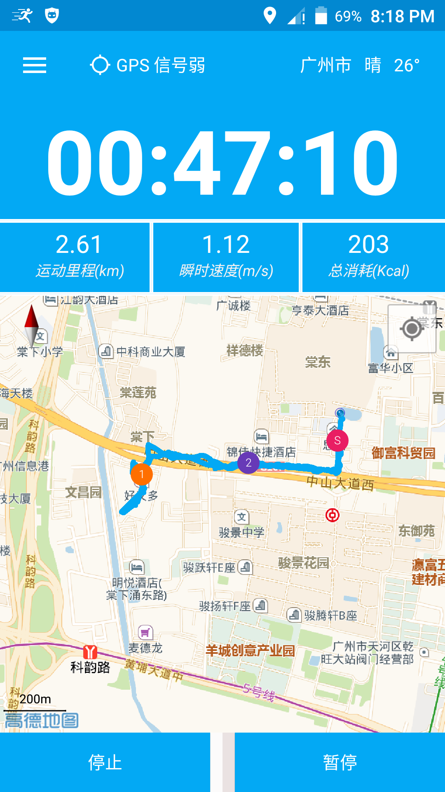</td>
<td>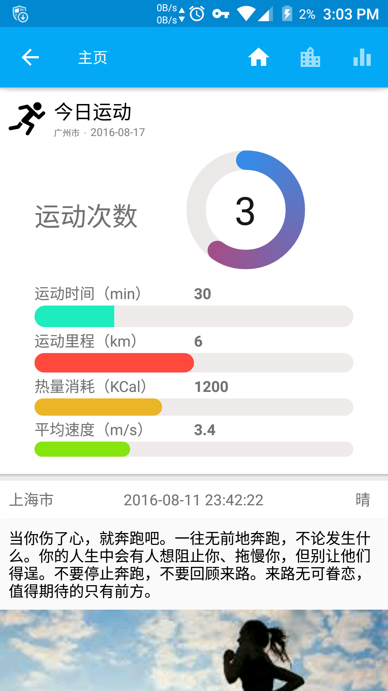</td>
<td>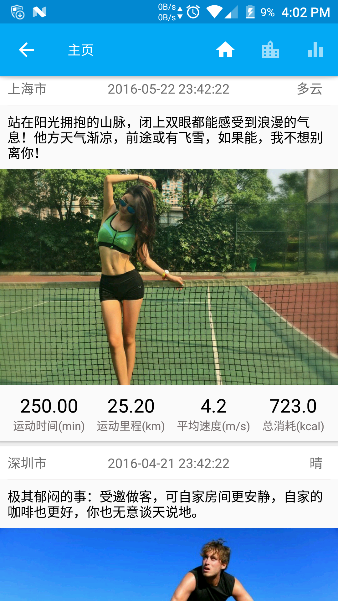</td>
<td>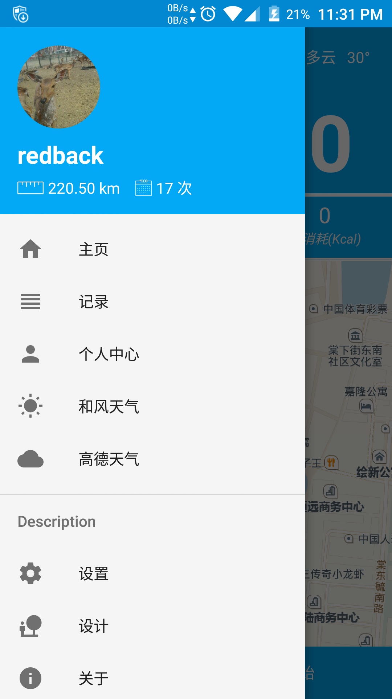</td>
</tr>
</table>
<table>
<tr>
<td>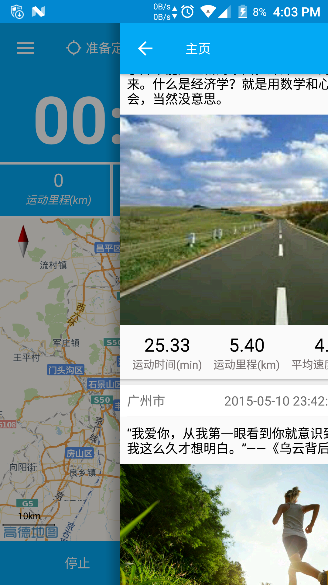</td>
<td>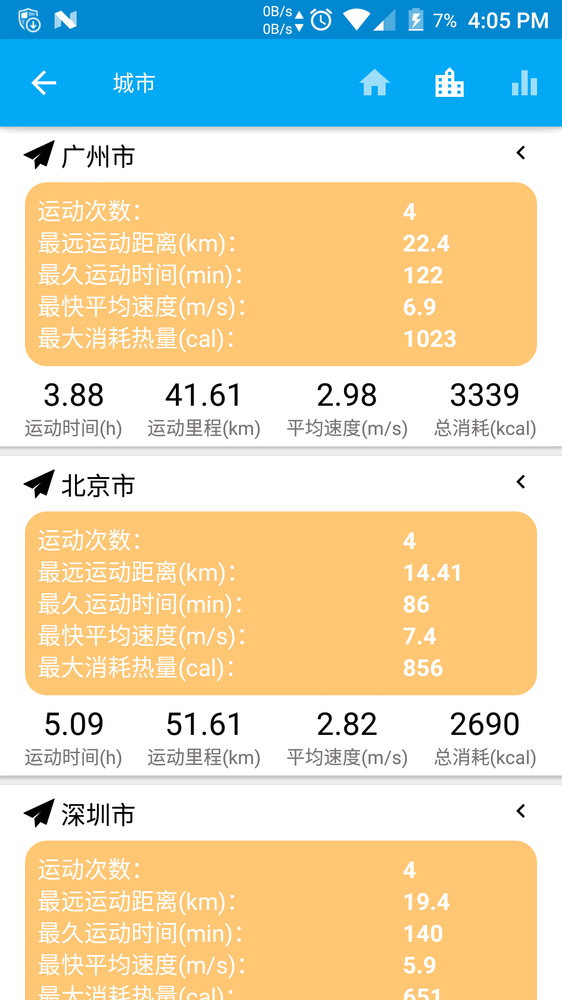</td>
<td>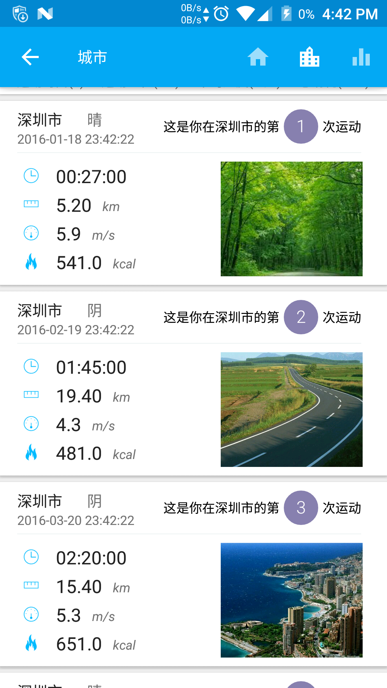</td>
<td>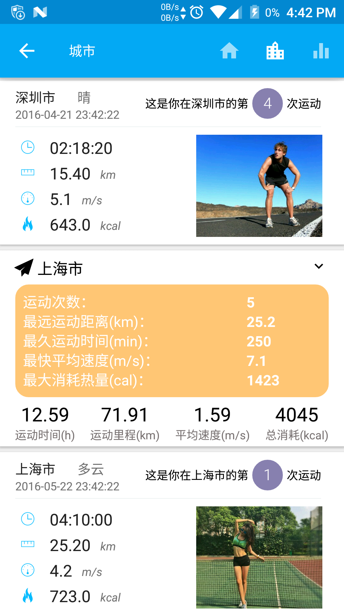</td>

</tr>
</table>
<table>
<tr>
<td>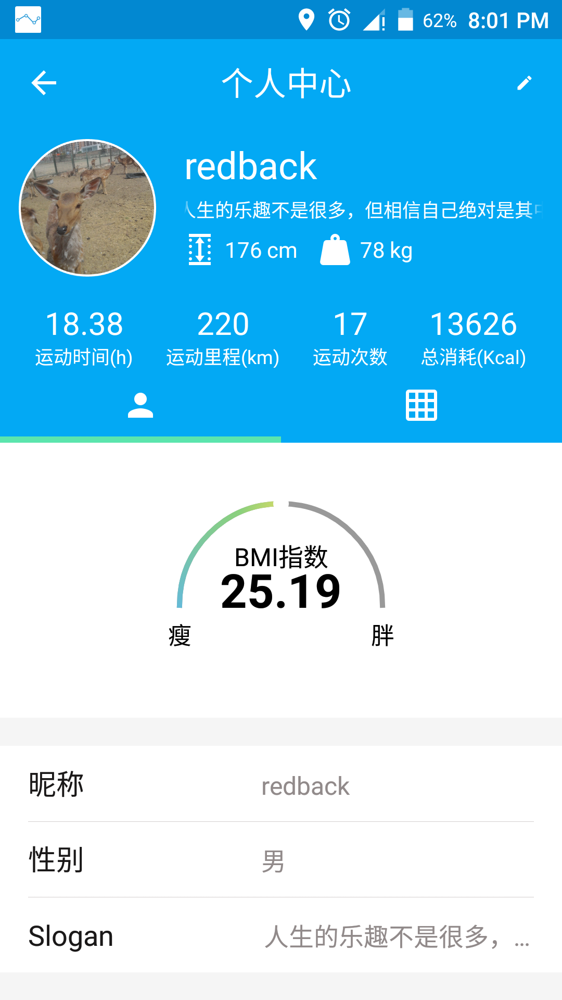</td>
<td>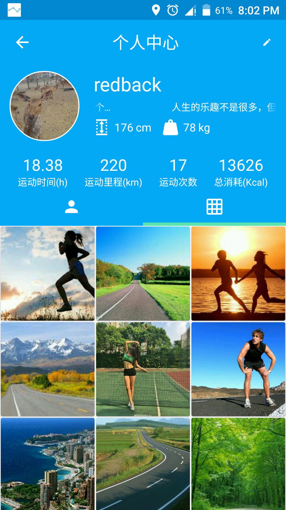</td>
<td>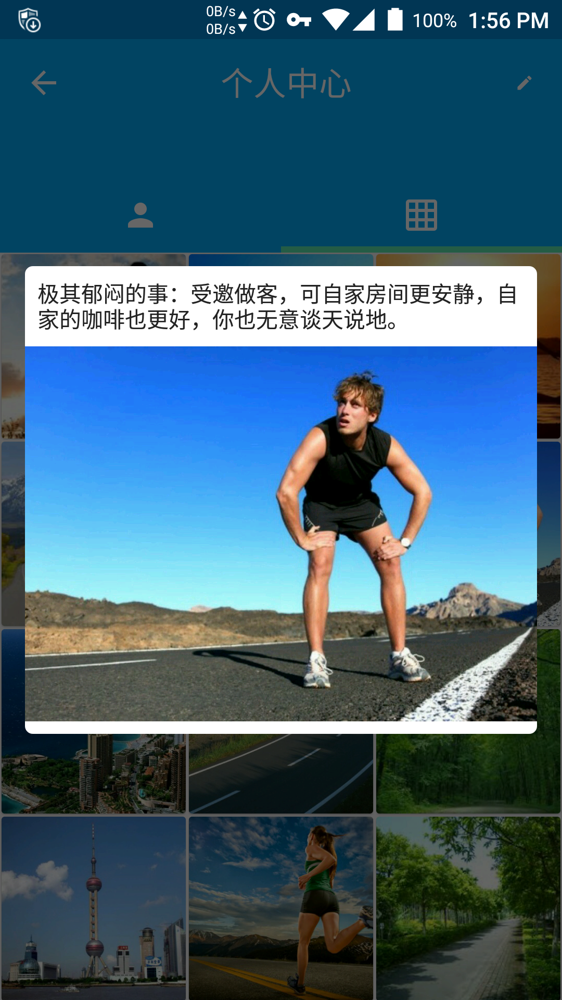</td>
<td>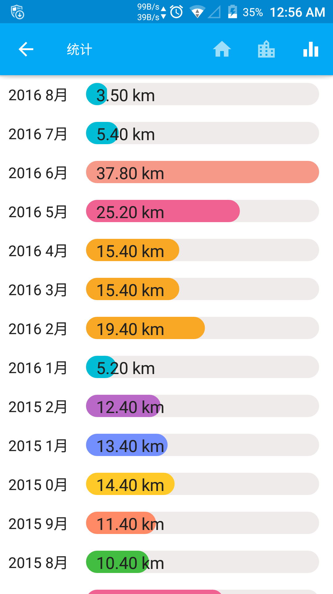</td>
</tr>
</table>

### 应用下载

**apk 直接下载：**[go.apk](./apk/go.apk)

**应用市场：**[360应用市场](./apk/go.apk)